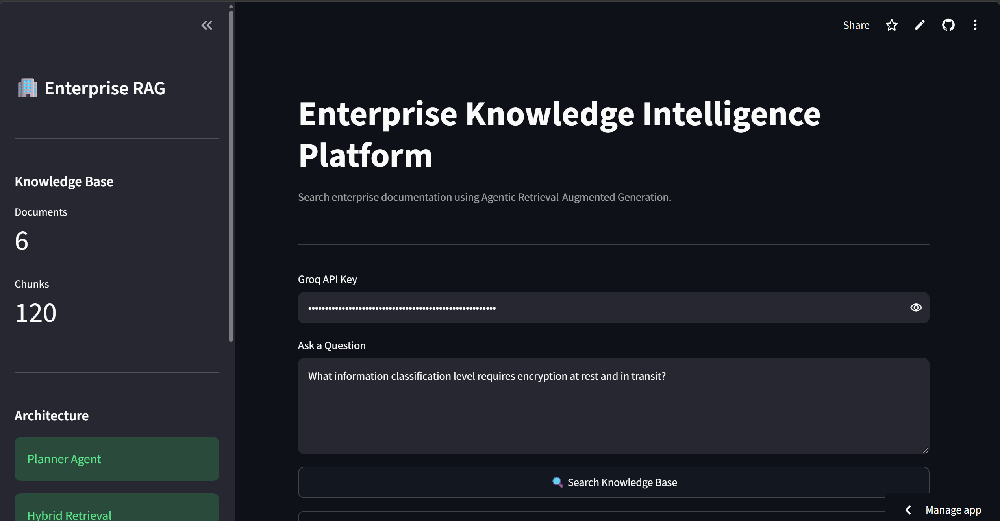
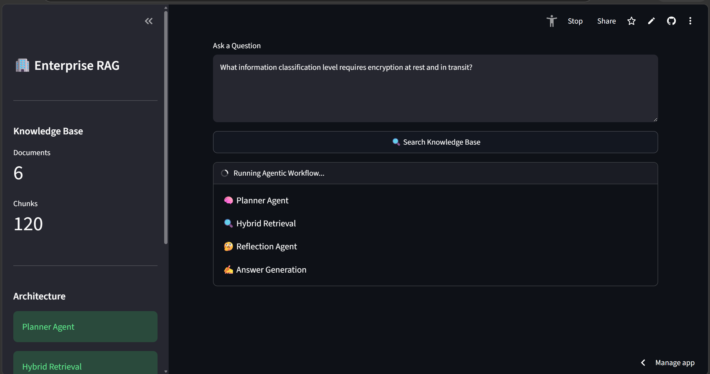
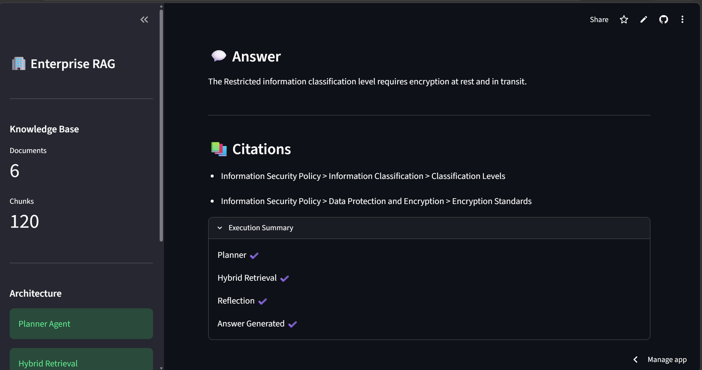

# 🏢 Enterprise Knowledge Intelligence Platform (Agentic RAG)

A production-oriented **Agentic Retrieval-Augmented Generation (RAG)** system built using **LangGraph**, **FastAPI**, and **Qdrant Cloud**. Unlike traditional chatbot-style RAG applications, this project focuses on **intelligent retrieval, reasoning, and grounded answering** using multiple AI agents.

## 🚀 Live Demo

🌐 **Frontend:** https://enterprise-knowledge-intelligence-platform-kmtfucp7hpnbsecr5hj.streamlit.app/

⚡ **Backend API:** https://enterprise-knowledge-intelligence.onrender.com

📚 **API Documentation:** https://enterprise-knowledge-intelligence.onrender.com/docs

---
# 📸 Demo

### Home Page

The application provides a clean Streamlit interface where users can securely enter their own Groq API key and query the enterprise knowledge base.



---

### Agentic Workflow

Every request follows a transparent Agentic RAG pipeline. The interface shows each stage of execution in real time.

- 🧠 Planner Agent
- 🔍 Hybrid Retrieval
- 🤔 Reflection Agent
- ✍️ Answer Generation



---

### Grounded Answers with Citations

Responses are generated exclusively from retrieved enterprise documents and include citations for transparency and traceability.



---

## 🚀 Overview

Enterprise organizations maintain thousands of pages of internal documentation including:

- Policies
- API documentation
- Runbooks
- Employee handbooks
- Incident response guides
- Security documentation

Searching these documents manually is slow and often returns irrelevant information.

This project provides an **AI-powered Enterprise Knowledge Platform** capable of understanding user intent, retrieving relevant information using hybrid search, validating retrieval quality, and generating grounded answers with citations.

---

# ✨ Features

- 🤖 Planner Agent
- 🔍 Hybrid Retrieval (Dense + Sparse)
- 📚 Qdrant Cloud Vector Database
- 🧠 Semantic Search using MiniLM Embeddings
- 🔑 BM25 Keyword Search
- 🔄 Reciprocal Rank Fusion (RRF)
- 🤔 Reflection Agent
- 💬 Answer Generation Agent
- 📖 Grounded Answers with Citations
- 🌐 FastAPI Backend
- 🎨 Streamlit Frontend
- 📊 LangSmith Tracing
- 📝 Structured Outputs using Pydantic
- 🪵 Application Logging

---

# 🏗️ Architecture

## System Architecture

```
                    User
                      │
                      ▼
               Streamlit UI
                      │
                      ▼
                FastAPI Backend
                      │
                      ▼
               LangGraph Workflow
                      │
        ┌─────────────┼─────────────┐
        ▼             ▼             ▼
   Planner Agent  Hybrid Retriever Reflection
                      │
          Dense + Sparse Retrieval
                      │
               Reciprocal Rank Fusion
                      │
                      ▼
               Answer Generation
                      │
                      ▼
         Grounded Response + Citations
```
## Deployment Architecture

```
                Streamlit Cloud
                       │
                       ▼
                FastAPI (Render)
                       │
                       ▼
             LangGraph Workflow
        ┌──────────┬──────────┬──────────┐
        ▼          ▼          ▼
    Planner   Hybrid Search Reflection
                       │
                       ▼
                 Qdrant Cloud

---

# 🧠 Workflow

### 1. Planner Agent

The planner analyzes the user's question and determines:

- User intent
- Query rewriting
- Query decomposition (when required)
- Metadata filters
- Retrieval strategy
- Top-K retrieval size

---

### 2. Hybrid Retriever

Retrieval combines:

- Dense Semantic Search
- Sparse BM25 Keyword Search

The results are merged using:

- Reciprocal Rank Fusion (RRF)

This provides significantly better retrieval quality than using either search technique individually.

---

### 3. Reflection Agent

Before generating a response, the Reflection Agent evaluates whether the retrieved evidence is sufficient.

If the retrieved context is insufficient, the workflow performs another retrieval attempt.

---

### 4. Answer Agent

The Answer Agent generates a final response using only the retrieved context.

Every answer includes citations to improve transparency and reduce hallucinations.

---

# ⚙️ Tech Stack

## Backend

- Python
- FastAPI
- LangGraph
- LangChain
- Pydantic

## AI

- Groq API
- Llama Models
- Agentic RAG

## Retrieval

- Qdrant Cloud
- Dense Embeddings
- BM25 Sparse Search
- Reciprocal Rank Fusion

## Frontend

- Streamlit

## Observability

- LangSmith
- Logging

---

# 📂 Project Structure

```
enterprise_rag/

│
├── app/
│   ├── agents/
│   ├── core/
│   ├── graph/
│   ├── ingestion/
│   ├── llm/
│   ├── models/
│   ├── retrieval/
│   └── main.py
│
├── documents/
├── streamlit_app.py
├── requirements.txt
└── README.md
```

---

# 📄 Knowledge Base

The demo knowledge base contains enterprise documents such as:

- Employee Handbook
- Customer Refund Policy
- API Documentation
- Deployment Runbook
- Information Security Policy
- Incident Response Playbook

These documents are chunked, embedded, and indexed into Qdrant Cloud.

---

# 🔍 Hybrid Search

Instead of relying solely on semantic search, the platform combines:

### Dense Retrieval

- Sentence Transformers
- MiniLM Embeddings
- Cosine Similarity

### Sparse Retrieval

- BM25

### Fusion

- Reciprocal Rank Fusion (RRF)

This significantly improves retrieval quality for both semantic and keyword-heavy queries.

---
# 🎯 Key Design Decisions

### Why LangGraph?

LangGraph provides explicit workflow orchestration, making the multi-agent pipeline easier to understand, debug, and extend.

### Why Hybrid Retrieval?

Dense retrieval captures semantic similarity, while BM25 improves keyword matching. Combining both using Reciprocal Rank Fusion (RRF) improves retrieval quality across different query types.

### Why Reflection?

The Reflection Agent validates whether the retrieved evidence is sufficient before answer generation, reducing the likelihood of responses based on weak or irrelevant context.

### Why User-Provided API Keys?

Instead of embedding an LLM API key in the backend, the application accepts a user-provided Groq API key. This keeps deployment lightweight while allowing users to experiment with the application using their own credentials.
---

# 📊 LangSmith

The project integrates LangSmith for:

- Workflow tracing
- Prompt inspection
- Latency monitoring
- Debugging
- LLM observability

---

# 📝 API Example

### Request

```json
POST /query

{
    "query":"What is the standard refund window for subscription services?",
    "api_key":"YOUR_GROQ_API_KEY"
}
```

### Response

```json
{
    "answer":"The standard refund window for subscription services is 30 days from purchase.",
    "citations":[
        "Customer Refund Policy > Subscription Refund Terms > Standard Refund Window"
    ]
}
```

---
# 🧪 Try It Yourself

Using the live demo is simple:

1. Open the Streamlit application.
2. Enter your own Groq API key.
3. Ask a question about the enterprise knowledge base.
4. Review the grounded answer and supporting citations.

> **Note:** The application does not store or persist your API key. It is used only to process your request.

---

# ▶️ Running the Project

## Clone

```bash
git clone <repository_url>
```

## Install

```bash
pip install -r requirements.txt
```

## Run FastAPI

```bash
uvicorn app.main:app --reload
```

## Run Streamlit

```bash
streamlit run streamlit_app.py
```

---

# 📈 Current Capabilities

- ✅ Agentic Workflow
- ✅ Hybrid Retrieval
- ✅ Query Rewriting
- ✅ Reflection
- ✅ Citation Generation
- ✅ LangGraph Orchestration
- ✅ FastAPI Backend
- ✅ Streamlit Frontend
- ✅ LangSmith Integration

---

# 🔮 Future Enhancements (Version 2)

The following improvements are planned for future iterations:

### Evaluation

- RAGAS Evaluation Pipeline
- Retrieval Metrics (Hit@K, Recall@K, MRR)
- Automated Benchmarking

### Retrieval

- Cross-Encoder Reranking
- Metadata-aware Retrieval
- Query Expansion
- Adaptive Retrieval Strategies

### AI

- Multi-Agent Collaboration
- Multi-turn Conversations
- Streaming Responses
- Tool Calling
- Confidence Scoring

### Enterprise Features

- Authentication & Authorization
- Role-Based Access Control (RBAC)
- Multi-Tenant Knowledge Bases
- Document Upload & Automatic Indexing
- Versioned Knowledge Base Management

### Performance

- Response Caching
- Asynchronous Retrieval
- Batch Ingestion
- Performance Monitoring

### Deployment

- Docker
- Render Deployment
- CI/CD using GitHub Actions

---

# 🎯 Project Goals

This project was built to demonstrate practical AI Engineering skills, including:

- Agentic AI Systems
- Retrieval-Augmented Generation
- LangGraph Orchestration
- Modern Vector Databases
- Hybrid Search
- Production-Oriented API Development
- AI System Observability

---

# 🙌 Acknowledgements

Built using:

- LangGraph
- LangChain
- FastAPI
- Qdrant Cloud
- Groq
- Streamlit
- LangSmith

---

## ⭐ If you found this project interesting, consider giving it a star!